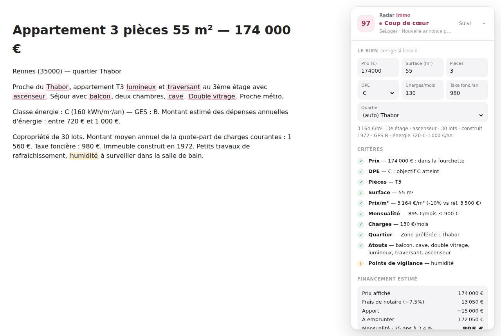
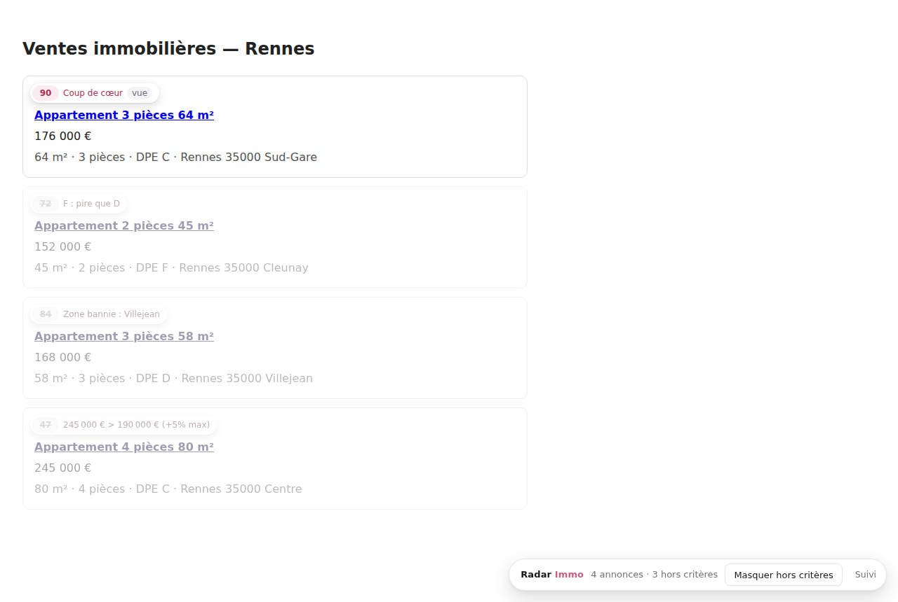
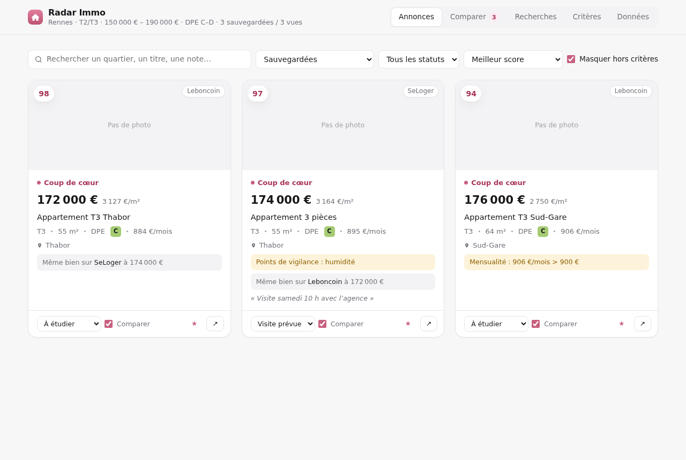
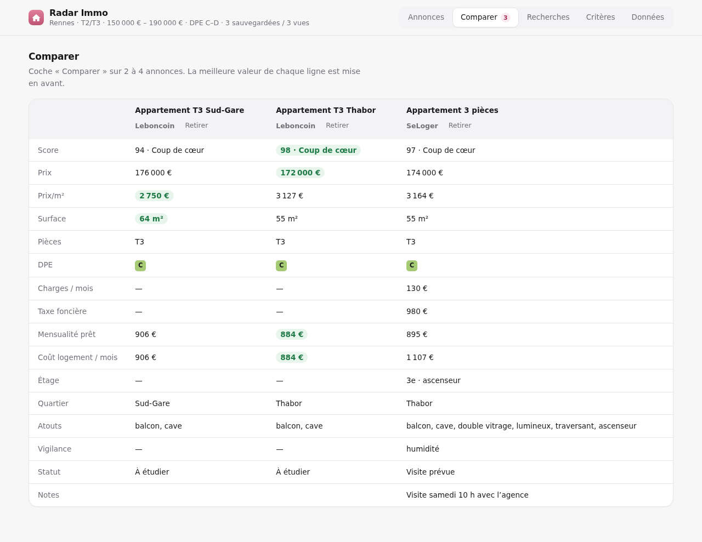
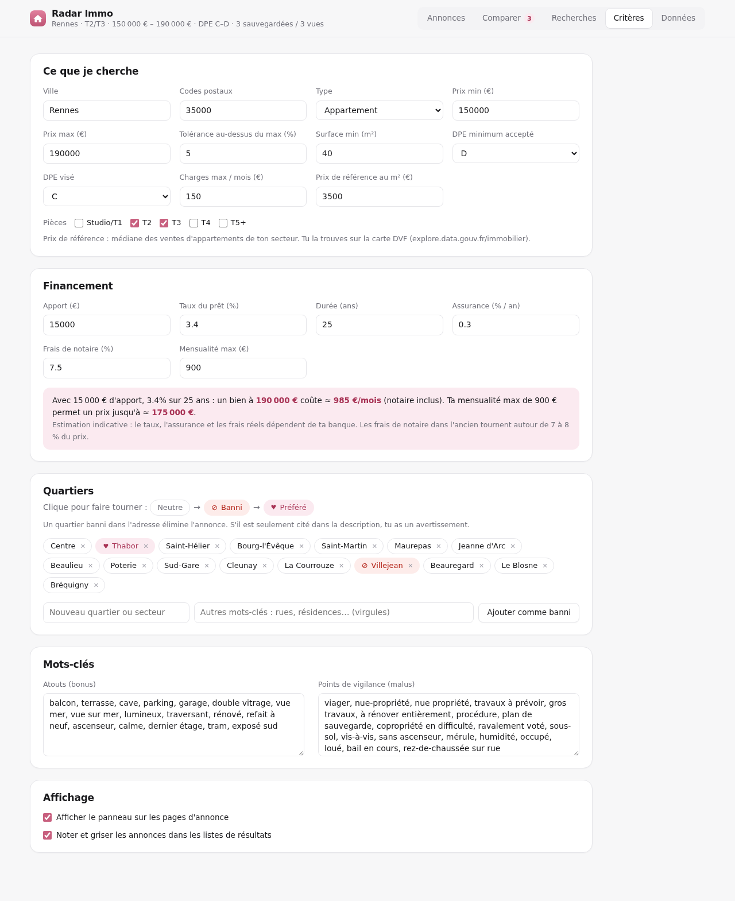
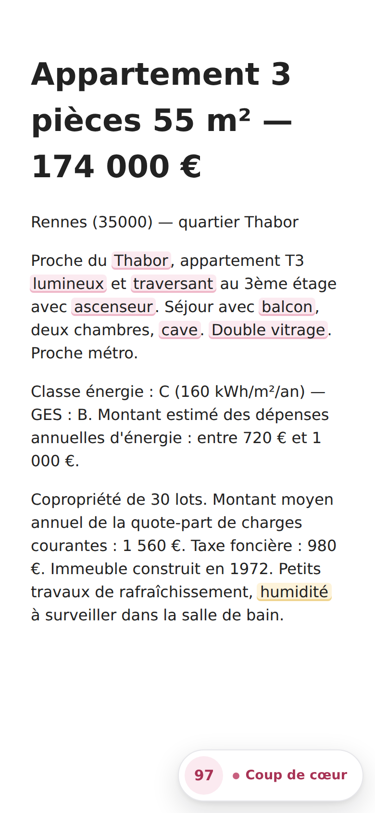
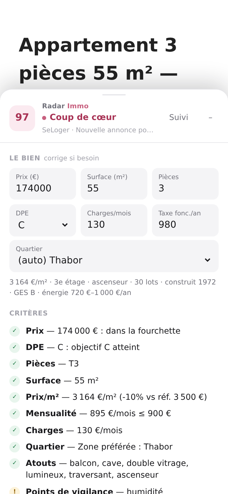
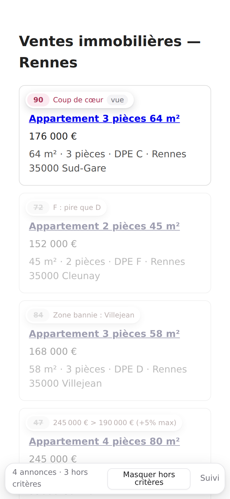
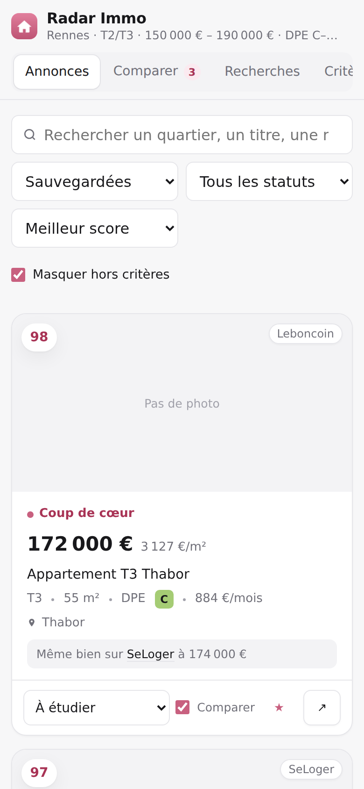

<div align="center">


# Radar Immo

**Ton copilote pour la recherche d'appartement.**
Note chaque annonce selon tes critères, suit les baisses de prix et repère le même bien publié sur plusieurs sites.




</div>

---

## Sommaire

- [Fonctionnalités](#fonctionnalités)
- [Sites pris en charge](#sites-pris-en-charge)
- [Installation](#installation)
- [Premiers pas](#premiers-pas)
- [Comment le score est calculé](#comment-le-score-est-calculé)
- [Compte et synchronisation](#compte-et-synchronisation)
- [Confidentialité](#confidentialité)
- [Développement](#développement)
- [Limites connues](#limites-connues)
- [Contribuer](#contribuer) · [Licence](#licence)

## Fonctionnalités

### Sur une page d'annonce
- **Score sur 100 et verdict** (*Coup de cœur*, *Intéressant*, *Mitigé*, *Peu adapté*, *Éliminé*) avec le détail critère par critère.
- **Critères éliminatoires** : budget dépassé, DPE trop mauvais, quartier banni, mauvais type de bien.
- **Extraction automatique** du prix, de la surface, des pièces, du DPE et du GES, ainsi que des charges, de la taxe foncière, de l'étage, de l'ascenseur, du nombre de lots, de l'année de construction et des dépenses d'énergie.
- **Champs corrigeables** : si une valeur est mal lue, tu la corriges et le score se recalcule. La correction est mémorisée.
- **Financement estimé** : frais de notaire, montant emprunté, mensualité, coût total du crédit et coût du logement par mois (prêt, charges et taxe foncière).
- **Prix au m²** comparé à une référence de secteur.
- **Doublons entre sites** : « Probablement le même bien sur SeLoger à 1 000 € de moins ».
- **Historique de prix** : les baisses sont signalées quand tu reviens sur une annonce.
- **Mots-clés surlignés** dans la description : atouts (balcon, cave, traversant…) et points de vigilance (viager, humidité, procédure…).
- **Liens de vérification** : prix de vente réels (DVF), Géorisques, DPE (ADEME), registre des copropriétés.

### Sur une page de résultats
- Une **pastille de score** sur chaque annonce.
- Les annonces **hors critères sont grisées** avec leur raison, et un bouton permet de les masquer.
- Repères visuels : annonce déjà vue, sauvegardée ★ ou **en baisse**.

### Tableau de bord
- **Suivi** de chaque annonce : statut (à étudier, contacté, visite prévue, visité, offre, écarté), notes et **checklist de visite**.
- **Comparateur** de 2 à 4 annonces côte à côte, avec la meilleure valeur de chaque ligne mise en avant.
- **Recherches enregistrées** : ta tournée quotidienne s'ouvre en un clic.
- **Critères** : budget, pièces, surface, DPE, charges, financement, quartiers bannis ou préférés, mots-clés.
- **Export et import** en JSON et CSV.
- **Compte (facultatif)** : tes critères et tes annonces synchronisés entre tes navigateurs et l'application web.

<table>
  <tr>
    <td width="50%"></td>
    <td width="50%"></td>
  </tr>
  <tr>
    <td></td>
    <td></td>
  </tr>
</table>

### Sur téléphone
Sur petit écran, le panneau devient une **feuille qui monte du bas de l'écran**, et le tableau de bord passe sur une colonne.

<p align="center">
  
  
  
  
</p>

## Sites pris en charge

Leboncoin · SeLoger · PAP · Bien'ici · Logic-Immo · Ouest-France Immo · Figaro Immobilier · ParuVendu · Immobilier.notaires · Orpi · Century 21 · Laforêt · Guy Hoquet · IAD · Safti · Capifrance · AVendreALouer · Superimmo · Entreparticuliers

**Autre site**, par exemple une agence locale : sur ordinateur, fais un clic droit puis *Analyser cette annonce avec Radar Immo*, ou passe par le popup de l'extension.

## Installation

Récupère les paquets dans les [Releases](../../releases), ou construis-les toi-même avec `npm run build` (voir [Développement](#développement)).

### Chrome, Edge, Brave
1. Décompresse `radar-immo-<version>-chrome.zip`.
2. Ouvre `chrome://extensions` et active le **Mode développeur**.
3. Clique sur **Charger l'extension non empaquetée** et choisis le dossier décompressé.

> Pendant le développement, tu peux charger directement le dossier `src/`.

### Firefox sur ordinateur
- **Pour tester** : ouvre `about:debugging#/runtime/this-firefox`, clique sur *Charger un module temporaire* et choisis `src/manifest.json`. Le module reste chargé jusqu'au redémarrage.
- **Pour une installation permanente** : fais signer le paquet (voir ci-dessous), puis ouvre le fichier `.xpi` dans Firefox.

### Firefox sur Android
Chrome pour Android et les navigateurs dérivés de Chromium (Vanadium, Samsung Internet…) n'acceptent pas les extensions. **Firefox pour Android, lui, les accepte.**

1. **Faire signer le paquet par Mozilla.** C'est gratuit et l'extension reste privée.
   - Crée un compte sur le [Developer Hub](https://addons.mozilla.org/developers/).
   - Choisis *Soumettre une nouvelle extension*, puis **« Sur votre propre site »** (auto-distribution, non listée).
   - Envoie `radar-immo-<version>-firefox.zip`. À la question *« Devez-vous communiquer votre code source ? »*, réponds **Non** : aucun outil de build ne transforme le code.
   - Télécharge le fichier `.xpi` signé.
2. **Installer sur le téléphone.**
   - Dans Firefox : *Paramètres → À propos de Firefox*, puis tape **5 fois sur le logo**.
   - Reviens dans *Paramètres* et ouvre **Install extension from file**, puis choisis le `.xpi`.
3. **Si le panneau n'apparaît pas**, va dans *Extensions → Radar Immo → Permissions* et autorise les sites d'annonces.

> Astuce : dans l'appli Leboncoin, *Partager → Firefox* ouvre l'annonce dans Firefox, où elle est analysée.

## Premiers pas

1. **Règle tes critères.** L'onglet *Critères* s'ouvre à l'installation et contient un **exemple fictif (Rennes)** à remplacer par ta recherche : ville, codes postaux, budget, pièces, surface, DPE, financement.
2. **Configure tes quartiers.** Clique sur un quartier pour le faire passer de *neutre* à ⊘ *banni*, puis à ♥ *préféré*. Tu peux ajouter tes propres secteurs avec des mots-clés alternatifs (noms de rues, de résidences…).
3. **Ajuste le prix de référence au m².** Mets la médiane de ton secteur, que tu trouves sur la [carte DVF](https://explore.data.gouv.fr/fr/immobilier).
4. **Enregistre tes recherches.** Filtre sur chaque site, colle l'URL de la page de résultats dans *Recherches*, puis utilise *Tout ouvrir* chaque jour.
5. **Navigue normalement** : chaque annonce ouverte est analysée. Clique sur *Sauvegarder* pour la retrouver dans le tableau de bord.

## Comment le score est calculé

| Critère | Poids | Détail |
|---|---:|---|
| Prix | 25 | Plein score dans ta fourchette. **Éliminatoire** au-delà du max + tolérance. |
| DPE | 20 | Plein score au niveau visé. **Éliminatoire** en dessous du minimum accepté. |
| Prix au m² | 15 | Comparé à ta référence de secteur. |
| Pièces | 10 | Selon les tailles cochées (T1 à T5+). |
| Surface | 10 | Proportionnel sous la surface minimale. |
| Mensualité | 10 | Comparée à ta mensualité max (notaire inclus, apport déduit). |
| Charges | 5 | Comparées à ton plafond mensuel. |
| Quartier | 5 | Bonus si préféré. **Éliminatoire** si banni *dans l'adresse*, simple avertissement si le quartier est seulement cité dans la description. |
| Mots-clés | ± | +2 par atout (6 max), −5 par point de vigilance (15 max). |

Seuils : **Coup de cœur** à partir de 80, **Intéressant** à partir de 62, **Mitigé** à partir de 45. Une annonce qui touche un critère éliminatoire est marquée **Éliminé**, quel que soit son score.

Les DPE **E, F et G** sont signalés avec leur date d'interdiction à la location fixée par la loi Climat et Résilience (G : 2025, F : 2028, E : 2034).

## Compte et synchronisation

La connexion est **facultative**. Sans compte, l'extension fonctionne entièrement en local, comme avant.

Une fois connecté (*Tableau de bord → Données → Se connecter*), tes critères et tes annonces sont synchronisés avec l'[API Radar Immo](server/README.md) : tu les retrouves sur tes autres navigateurs et dans l'application web. La synchronisation a lieu quelques secondes après chaque modification, toutes les 15 minutes, et à la demande (*Synchroniser maintenant*). En cas de modification des deux côtés, la plus récente gagne.

- **Connexion** : l'extension ouvre la page de connexion de l'application web, qui lui renvoie un jeton après ton accord. Tu peux aussi coller un jeton dans *Réglages avancés*.
- **Hors ligne** : tout continue de fonctionner. Les modifications partent à la synchronisation suivante.
- **Session expirée** : tes données locales sont conservées, il suffit de te reconnecter.

Les adresses de l'API et de la page de connexion sont intégrées au build (`RADAR_API_URL`, `RADAR_LOGIN_URL`, voir [Développement](#développement)) ou saisies dans *Réglages avancés*.

## Confidentialité

**Sans compte**, Radar Immo **ne collecte rien et n'envoie rien** : pas de serveur, pas de statistiques, pas de traceur. Tes critères et tes annonces restent dans le stockage local de ton navigateur. **Avec un compte**, ils sont aussi envoyés à l'API Radar Immo pour être synchronisés, et rien d'autre. Dans les deux cas, la seule chose chargée depuis l'extérieur, ce sont les photos des annonces sauvegardées, qui viennent de leur site d'origine. Voir [PRIVACY.md](PRIVACY.md).

## Développement

**Prérequis** : Node.js 20 ou plus. Le code de l'extension n'a **aucune dépendance** et ne passe par aucune étape de build : ce que tu lis dans `src/` est exactement ce qui est publié.

```bash
npm run check        # syntaxe JS, manifest, cohérence des versions
npm test             # tests unitaires (runner intégré de Node)
npm run build        # génère dist/radar-immo-<version>-{chrome,firefox}.zip

# Build relié au service (adresses intégrées au paquet)
RADAR_API_URL=https://api.exemple.fr RADAR_LOGIN_URL=https://app.exemple.fr/connexion-extension npm run build

npm install          # uniquement pour les tests de bout en bout (Playwright)
npx playwright install chromium
npm run test:e2e     # charge l'extension dans Chromium sur des pages simulées
npm run screenshots  # idem + régénère docs/screenshots/
```

### Structure

```
radar-immo/
├── src/                      # l'extension, telle que publiée
│   ├── manifest.json         # MV3, compatible Chrome et Firefox
│   ├── background.js         # service worker (Chrome) / page d'événements (Firefox), synchro périodique
│   ├── lib/radar.js          # logique partagée : extraction, score, financement, stockage
│   ├── lib/cloud.js          # compte et synchronisation avec l'API (facultatif)
│   ├── content/content.js    # script de page : panneau, pastilles, surlignage
│   ├── popup/                # popup de la barre d'outils
│   ├── dashboard/            # tableau de bord (annonces, comparateur, critères, compte…)
│   ├── auth/callback.html    # retour de la page de connexion de l'application web
│   └── icons/
├── server/                   # API Radar Immo (Node.js, Fastify, PostgreSQL) — voir server/README.md
├── tests/
│   ├── unit/                 # tests de lib/radar.js et lib/cloud.js
│   └── e2e/                  # Playwright + pages d'annonces simulées
├── scripts/
│   ├── build.mjs             # empaquetage zip reproductible, sans dépendance
│   └── check.mjs             # vérifications avant build
├── docs/
│   ├── CDC-front-end.md      # cahier des charges de l'application web
│   └── screenshots/
└── .github/                  # CI, modèles d'issues et de PR
```

### Architecture en bref
- **`lib/radar.js`** est chargé partout (page, popup, tableau de bord, arrière-plan, tests Node) et expose `globalThis.RadarImmo`. Toute la logique métier y vit.
- **Extraction** : les sources structurées passent en priorité (données `__NEXT_DATA__` de Leboncoin, JSON-LD schema.org), puis le texte de la page complète les manques. Les corrections de l'utilisateur écrasent toujours le reste.
- **Stockage** : `storage.local`, avec les clés `settings` et `listings`. Chaque modification est datée (`updatedAt`, `settingsUpdatedAt`) et chaque suppression laisse une « tombe » (`deleted`), ce qui permet la synchronisation. La connexion au compte est dans la clé `cloud`, jamais exportée.
- **Synchronisation** (`lib/cloud.js`, lancée par `background.js`) : envoie les changements locaux à `POST /v1/sync` et applique ceux reçus, la dernière écriture gagnant. Détails dans [server/README.md](server/README.md#synchronisation).
- **Compatibilité** : l'API est choisie à l'exécution (`browser` sous Firefox, `chrome` sinon). Les fonctions absentes sur Android (menus contextuels, badge) sont ignorées sans erreur.

Pour ajouter un site ou améliorer une détection, voir [CONTRIBUTING.md](CONTRIBUTING.md#ajouter-ou-corriger-un-site).

## Limites connues

- L'extraction lit le HTML des sites. **Si un site change sa mise en page, un champ peut être mal lu** : corrige-le dans le panneau et [ouvre une issue](../../issues/new/choose).
- Les quartiers sont reconnus **par mots-clés** : ajoute des noms de rues pour plus de précision.
- Le financement est une **estimation indicative** : le taux, l'assurance et les frais réels dépendent de ta banque et du notaire.
- **Sans compte**, les données ne sont pas synchronisées entre appareils : utilise *Données → Exporter / Importer*.
- Ce n'est pas un conseil financier ni immobilier.

## Contribuer

Les contributions sont bienvenues, qu'il s'agisse de nouveaux sites, de corrections de détection ou d'idées. Lis [CONTRIBUTING.md](CONTRIBUTING.md) et le [code de conduite](CODE_OF_CONDUCT.md). Les contributeurs sont listés dans [CONTRIBUTORS.md](CONTRIBUTORS.md), et l'historique des versions dans [CHANGELOG.md](CHANGELOG.md).

## Licence

[MIT](LICENSE) © 2026 plbls

Données et services publics référencés (non inclus dans le dépôt) : [DVF](https://explore.data.gouv.fr/fr/immobilier) (DGFiP / Etalab), [Observatoire DPE](https://observatoire-dpe-audit.ademe.fr/) (ADEME), [Géorisques](https://www.georisques.gouv.fr/), [Registre des copropriétés](https://www.registre-coproprietes.gouv.fr/). Les noms de sites cités appartiennent à leurs propriétaires respectifs. Radar Immo n'est affilié à aucun d'entre eux.
